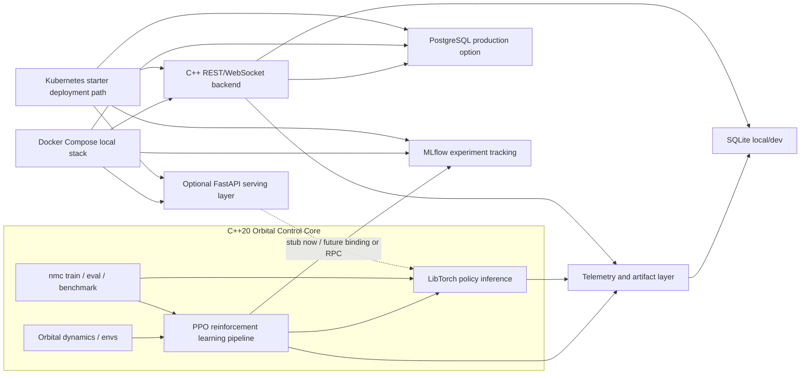

<p align="center">
  
</p>

# Orbital Neural Control CPP

C++20 orbital autonomy and AI deployment platform featuring PPO reinforcement learning, LibTorch inference, PostgreSQL telemetry, FastAPI services, MLflow experiment tracking, Docker-based workflows, Kubernetes deployment manifests, mission replay capabilities, and production-oriented MLOps architecture.

## Technology Stack

<p>
  
  
  
  
  
  
  
  
  
  
  
  
</p>

## Scope and Status

### Implemented baseline (CI-gated)

- `nmc` runtime (CPU-first) in layered C++20 architecture under `src/`.
- PPO actor-critic refactor with explicit components:
  - `GaussianPolicy`
  - `ValueNetwork`
  - `RolloutBuffer`
  - `PPOTrainer`
- Point-mass reward shaping upgrade with configurable orbital-friendly terms.
- Deterministic smoke benchmark path.
- Artifact integrity flow under `artifacts/` (`runs/`, `latest/`, `benchmarks/`).
- SQLite persistence (`runs`, `episodes`, `events`, `benchmarks`) with extended forward-compatible telemetry tables.
- Optional backend database selection through `DB_BACKEND=sqlite|postgres`, with SQLite as local/dev default and PostgreSQL as a production-style backend service option.

### Optional stack modules (not required for baseline `nmc`)

- `backend/` C++ REST + WebSocket service
- `frontend/` React + TypeScript mission replay console
- `mlops/` and `training/` orchestration with MLflow
- `services/fastapi-serving/` optional FastAPI deployment/API layer
- `core/`, `control/`, `sim/`, `rl/` expansion tracks

### Roadmap (not marketed as shipped)

- Full TensorRT production deployment pipeline (advanced calibration datasets + multi-profile packaging)
- CUDA-first training path
- richer control-safety formalism and hardware-in-the-loop integration

## Architecture (Baseline Runtime)

- `src/domain`: PPO, env contracts, inference contracts, config types
- `src/application`: train/eval/benchmark orchestrators
- `src/infrastructure`: artifacts, persistence, reporting
- `src/interfaces`: CLI interface and command parsing
- `src/common`: time/json utility primitives

Optional backend architecture:

- `backend/src/common`
- `backend/src/domain`
- `backend/src/persistence`
- `backend/src/telemetry`
- `backend/src/replay`
- `backend/src/application`
- `backend/src/transport`

## System Architecture



## Engineering Highlights

This project demonstrates a C++20 systems-oriented AI architecture with a reinforcement learning control pipeline, LibTorch inference, MLflow experiment tracking, database abstraction for SQLite/PostgreSQL, optional API serving with FastAPI, containerized deployment with Docker, starter Kubernetes deployment manifests, and a CI/CD and reproducibility mindset. The implementation also emphasizes security-aware engineering practices such as environment-based configuration, parameterized SQL, input validation, ignored local secrets, and non-root service containers where practical.

## Quickstart (Repository Root)

All commands must run from repository root.

### 1) Bootstrap + configure + build baseline (vcpkg)

```bash
./tools/build_release.sh
./build/nmc help
```

Manual deterministic flow:

```bash
./tools/setup_vcpkg.sh
./tools/setup_libtorch.sh
cmake -S . -B build -G Ninja -DCMAKE_BUILD_TYPE=Release \
  -DCMAKE_C_COMPILER=gcc \
  -DCMAKE_CXX_COMPILER=g++ \
  -DCMAKE_TOOLCHAIN_FILE=external/vcpkg/scripts/buildsystems/vcpkg.cmake \
  -DVCPKG_TARGET_TRIPLET=x64-linux -DVCPKG_HOST_TRIPLET=x64-linux
cmake --build build
```

### 2) Smoke benchmark

```bash
./build/nmc benchmark --quick --name smoke_local --seed 7
```

### 3) Train

```bash
./build/nmc train --quick --run-id train_quick_001 --seed 7
```

### 4) Eval

```bash
./build/nmc eval --checkpoint artifacts/latest/checkpoint.pt --episodes 10 --backend libtorch --run-id eval_local_001 --seed 7
```

### 5) Optional TensorRT backend validation

The baseline remains CPU-first (`libtorch`). TensorRT backend names are accepted at runtime and can run in:

- native TensorRT mode (`.onnx` / `.engine` / `.plan`)
- LibTorch fallback mode (automatic fallback when TensorRT runtime/init fails)

```bash
# native build from ONNX -> engine (first run builds, next runs reuse engine cache)
./build/nmc eval --checkpoint artifacts/latest/checkpoint.onnx --backend tensorrt_fp16 --episodes 10 --seed 7 --run-id eval_trt_fp16_native

# explicit engine path
./build/nmc eval --checkpoint artifacts/latest/checkpoint.fp16.engine --backend tensorrt_fp16 --episodes 10 --seed 7 --run-id eval_trt_fp16_engine

# fallback mode (if TensorRT unavailable, falls back to .pt)
./build/nmc eval --checkpoint artifacts/latest/checkpoint.pt --backend tensorrt_fp16 --episodes 10 --seed 7 --run-id eval_trt_fp16_fallback
```

### 6) Validate artifact + SQLite contracts

```bash
python3 scripts/validate_artifacts.py --root artifacts --strict
```

## TensorRT Integration Status + Measured Data

Current implementation separates two states:

- **Shipped now**: native TensorRT runtime path for `.onnx`/`.engine` with builder + serialization + dynamic profile + precision fallback and runtime metadata in `evaluation_summary.json`.
- **Not shipped yet**: full production deployment flow (representative INT8 calibration corpus management and fleet-level engine packaging).

Measured comparison on **April 17, 2026** (`point_mass`, same quick-trained checkpoint, `episodes=20`, `seed=7`):

| Backend CLI | Runtime reported | Emulated | Avg episode return | Avg inference latency (ms) | P95 latency (ms) | Summary file |
| --- | --- | --- | ---: | ---: | ---: | --- |
| `libtorch` | `libtorch_cpu` | `false` | `48.0350` | `0.0290420` | `0.0327260` | `artifacts/runs/<eval_run_id>/evaluation_summary.json` |
| `tensorrt_fp16` | `tensorrt_fallback_libtorch` | `true` | `48.0350` | `0.0290775` | `0.0391200` | `artifacts/runs/<eval_run_id>/evaluation_summary.json` |
| `tensorrt_int8` | `tensorrt_fallback_libtorch` | `true` | `48.0350` | `0.0281963` | `0.0317110` | `artifacts/runs/<eval_run_id>/evaluation_summary.json` |

Interpretation:

- policy quality remains statistically aligned across backends for this smoke-scale workload.
- fallback mode preserves policy behavior and availability; latency delta reflects fallback overhead, not TensorRT kernel speed.
- these numbers are useful for parity confidence, not as claims of TensorRT acceleration.

Reproduce the table with one command:

```bash
./scripts/compare_inference_backends.sh
```

## API and Streaming Contracts (Optional Backend)

Contract source:

- `docs/openapi/orbital-api.yaml`

Implemented endpoints:

- `GET /health`
- `GET /version`
- `GET /runs`
- `GET /runs/{runId}`
- `GET /runs/{runId}/summary`
- `GET /runs/{runId}/telemetry`
- `GET /runs/{runId}/telemetry/window`
- `GET /runs/{runId}/events`
- `GET /runs/{runId}/artifacts`
- `GET /runs/{runId}/replay`
- `GET /benchmarks`
- `GET /benchmarks/{benchmarkId}`
- `POST /train/jobs`
- `POST /eval/jobs`
- `POST /benchmark/jobs`
- `GET /jobs/{jobId}`
- `GET /config/presets`

WebSocket:

- `/ws/telemetry/live`
- `/ws/runs/{runId}/stream`

Envelope fields:

- `type`
- `schema_version`
- `timestamp`
- `source`
- `run_id`
- `payload`

## Frontend Mission Console (Optional)

Current frontend stack is **React.js + TypeScript**

Implemented UX highlights:

- replay mode and live mode
- typed API client from OpenAPI contract (`frontend/src/shared/api/generated/orbital-api.ts`)
- 3D Earth mission viewport with OrbitControls, atmosphere glow, orbit lines, and animated satellite
- local high-quality Earth texture support (`frontend/public/textures/earth/*`) with safe procedural fallback
- orbit path + satellite trace + timeline scrubber + event markers
- technical telemetry and benchmark tables for engineering inspection
  


## Docker / Compose

Bring up optional services:

```bash
docker compose up --build -d mlflow backend frontend
```

Run the backend with SQLite, the default local/dev option:

```bash
DB_BACKEND=sqlite SQLITE_PATH=artifacts/experiments.sqlite docker compose up --build backend
```

Run a production-like local stack with PostgreSQL:

```bash
POSTGRES_PASSWORD=change-me DB_BACKEND=postgres docker compose --profile postgres up --build postgres backend
```

Run the optional FastAPI serving layer:

```bash
docker compose --profile api up --build fastapi-serving
curl http://localhost:8000/health
```

Run training service:

```bash
docker compose run --rm training
```

Logs:

```bash
docker compose logs -f mlflow backend frontend
```

Important hygiene:

- `.dockerignore` excludes host build outputs (`build*/`, `CMakeCache.txt`, `CMakeFiles/`, `artifacts/`) to prevent cache contamination.

## Database Configuration

SQLite remains the default for local development. Configure it with:

```bash
DB_BACKEND=sqlite
SQLITE_PATH=artifacts/experiments.sqlite
```

PostgreSQL can be selected for production-like testing or deployments:

```bash
DB_BACKEND=postgres
POSTGRES_HOST=localhost
POSTGRES_PORT=5432
POSTGRES_DB=orbital
POSTGRES_USER=orbital
POSTGRES_PASSWORD=replace-me
```

Credentials are read only from the environment. The backend applies safe connection and statement timeouts and uses parameterized queries for runtime reads.

Current scope: `DB_BACKEND` applies to the optional C++ backend service. The baseline `nmc` train/eval/benchmark CLI still writes local artifacts and SQLite experiment telemetry; a PostgreSQL writer for the CLI telemetry path is a remaining integration step.

## FastAPI Serving Layer

`services/fastapi-serving/` contains an optional Python API layer for deployment experiments:

- `GET /health`
- `GET /ready`
- `POST /control-step`
- `POST /predict`

The FastAPI service has Pydantic request/response models and input validation. Until a `pybind11` binding or internal RPC bridge to the C++/LibTorch control pipeline is implemented, `/control-step` returns a deterministic documented stub with TODO comments in code.

Run tests:

```bash
cd services/fastapi-serving
python3 -m pip install -r requirements-dev.txt
python3 -m pytest
```

## Kubernetes

Starter manifests live in `k8s/`:

```bash
cp k8s/secret.example.yaml /tmp/orbital-secret.yaml
# Edit /tmp/orbital-secret.yaml before applying; do not use the placeholder values.
kubectl apply -f /tmp/orbital-secret.yaml
kubectl apply -f k8s/configmap.yaml
kubectl apply -f k8s/postgres-statefulset.yaml -f k8s/postgres-service.yaml
kubectl apply -f k8s/mlflow-deployment.yaml -f k8s/mlflow-service.yaml
kubectl apply -f k8s/backend-deployment.yaml -f k8s/backend-service.yaml
kubectl apply -f k8s/fastapi-deployment.yaml -f k8s/fastapi-service.yaml
```

Before applying to a real cluster, replace `secret.example.yaml` values with environment-specific secrets and update image names. Do not apply the placeholder secret directly. These manifests are production-oriented starter files with resource limits and probes, but they are not hardened production infrastructure. Review TLS, ingress, network policies, persistent storage classes, backups, RBAC, and secret rotation for your cluster.

## Security Notes

- Do not commit `.env` or real credentials.
- Use environment variables for database and service configuration.
- SQLite is suitable for local/dev workflows; PostgreSQL is the production-style option.
- Backend SQL uses prepared/parameterized queries for runtime reads.
- FastAPI endpoints validate run IDs, vector sizes, numeric bounds, and supported backend names.
- Docker images avoid root where practical for the backend and FastAPI service.
- Kubernetes uses `secret.example.yaml` as a template only; no real secrets are included.
- See `SECURITY.md` for reporting guidance and known non-production limitations.

## Artifact and Persistence Contract

```text
artifacts/
  runs/<run_id>/
    manifest.json
    training_metrics.csv
    training_summary.json
    evaluation_summary.json
    live_rollout.csv
    checkpoints/policy_last.pt
    checkpoints/policy_last.meta
  latest/
    manifest.json
    training_metrics.csv
    checkpoint.pt
    checkpoint.meta
  benchmarks/
    latest.json
    latest.csv
  experiments.sqlite
```

DB docs:

- `docs/database/sqlite-telemetry.md`
- `backend/src/persistence/migrations/postgres_init.sql`

Run ID policy:

- all CLI/API `run_id` values must match `[A-Za-z0-9][A-Za-z0-9_.-]{0,63}`
- invalid IDs fail fast before file/DB writes
- `eval` updates `artifacts/latest/manifest.json` and summaries, but does not overwrite global latest checkpoint

Replay docs:

- `docs/replay/mission-replay.md`

## Documentation Index

- `SECURITY.md`
- `docs/build.md`
- `docs/dependency-diagram.md`
- `docs/architecture.md`
- `docs/architecture/backend-api.md`
- `docs/architecture/system-dataflow.md`
- `docs/architecture/tensorrt-backend.md`
- `docs/performance/backend-performance.md`
- `docs/performance/inference-backend-comparison.md`
- `docs/database/sqlite-telemetry.md`
- `docs/openapi/orbital-api.yaml`
- `docs/roadmap.md`

## Honest Constraints

- baseline runtime is CPU-first
- TensorRT native path requires build with `ENABLE_TENSORRT=ON` and local TensorRT + CUDA runtime libraries
- if TensorRT initialization fails, runtime automatically falls back to LibTorch to preserve pipeline availability
- backend/frontend remain optional stack modules
- PostgreSQL support currently covers the optional backend service read/API path; the baseline CLI telemetry writer remains SQLite-backed
- frontend 3D globe is mission-UI oriented and not a full geospatial GIS engine
