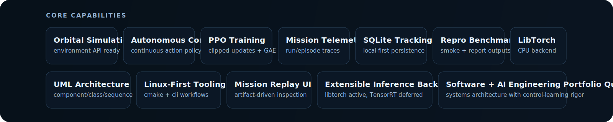
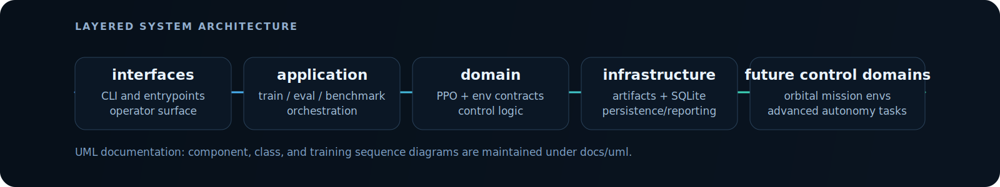
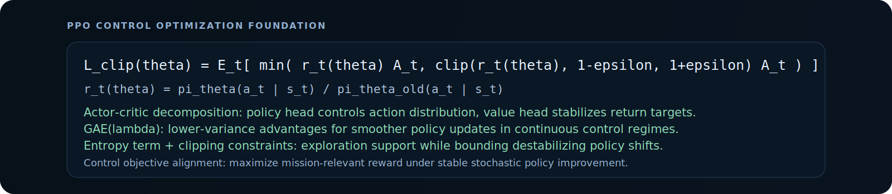

<p align="center">
  
</p>

# Orbital Neural Control CPP

**C++20 orbital autonomy systems platform for reinforcement learning, mission simulation, telemetry tracking, and extensible control architecture.**

CPU-first engineering baseline with PPO + LibTorch, SQLite mission telemetry persistence, reproducible benchmark workflows, and layered software architecture designed for advanced control-system evolution.

## Stack and Engineering Identity

<p align="center">
  
  
  
  
  
</p>

<p align="center">
  
  
  
  
  
</p>

<p align="center">
  <a href="https://github.com/gabriel-lab-ia/PPO_Neural-Control-cpp/actions/workflows/ci.yml"></a>
  
  
  
  
</p>

<p align="center">
  
</p>

## Why This Repository Exists

This repository exists to bridge **software engineering rigor** and **AI control-system development**:

- reproducible RL workflows that can survive CI and long-term maintenance
- architecture boundaries that support growth from toy environments to mission-scale simulations
- telemetry and persistence that make experiments auditable, not anecdotal

## Orbital Systems Vision

The near-term baseline is PPO continuous control in C++20.

The strategic direction is a mission-oriented autonomy stack:

- orbital environment adapters under a stable `Environment` contract
- policy optimization loops that can incorporate mission-level objectives
- telemetry pipelines for mission replay, failure analysis, and benchmark comparisons
- software architecture that supports advanced simulation domains without rewriting the RL core

## Architecture Overview

<p align="center">
  
</p>

Core code layout:

- `src/domain/`: PPO logic, model, environment interfaces, inference contracts
- `src/application/`: train/eval/benchmark orchestration
- `src/infrastructure/`: artifacts, checkpoints, SQLite persistence, reporting
- `src/interfaces/`: CLI surface and entrypoints
- `src/common/`: shared cross-cutting utilities

UML references:

- `docs/uml/component-diagram.md`
- `docs/uml/class-diagram.md`
- `docs/uml/sequence-training.md`

## Mathematical Control Foundation

<p align="center">
  
</p>

Practical interpretation in this project:

- clipped objective constrains policy ratio updates to reduce destructive jumps
- actor-critic split combines stochastic control policy and value stabilization
- GAE(lambda) improves advantage quality for training stability
- entropy regularization keeps exploration active in continuous action spaces
- policy outputs follow Gaussian control parameterization (mean + log std)

This keeps optimization behavior aligned with control-system reliability instead of raw reward chasing.

## Simulation and Telemetry Pipeline

```text
Build -> Train -> Evaluate -> Persist -> Benchmark -> Inspect
```

Operational commands:

```bash
./build/nmc train --env point_mass --seed 7 --updates 30
./build/nmc eval --checkpoint artifacts/latest/checkpoint.pt --episodes 10 --backend libtorch
./build/nmc benchmark --quick --name smoke
```

Artifacts produced under `artifacts/`:

```text
runs/<run_id>/manifest.json
runs/<run_id>/training_metrics.csv
runs/<run_id>/training_summary.json
runs/<run_id>/evaluation_summary.json
runs/<run_id>/checkpoints/policy_last.pt
benchmarks/latest.json
experiments.sqlite
```

## Experiment Tracking and Benchmarking

SQLite (`artifacts/experiments.sqlite`) stores:

- `runs`: lifecycle, config, status, summary
- `episodes`: train/eval episode telemetry
- `events`: runtime events and important transitions
- `benchmarks`: benchmark summaries

This provides local-first experiment traceability suitable for engineering iteration and review.

## CI and Reproducibility

CI workflow validates a meaningful baseline:

1. configure + build (CPU-first path)
2. CTest smoke benchmark execution
3. artifact existence validation (`benchmark`, `manifest`, `checkpoint`)

This repository treats reproducibility and validation as product-level requirements.

## Roadmap Toward Advanced Orbital Autonomy

- add mission-grade orbital environments under existing env interface
- extend reward/control objectives toward mission constraints and safety envelopes
- scale telemetry and benchmark diagnostics for comparative mission studies
- keep backend abstraction ready for future inference acceleration without breaking CPU-first baseline

See full roadmap: `docs/roadmap.md`

## Build Baseline

```bash
bash tools/setup_libtorch_cpu.sh
cmake --preset dev
cmake --build --preset build
```

Optional MuJoCo remains gated behind `NMC_ENABLE_MUJOCO=ON` and is not required for baseline CI path.
