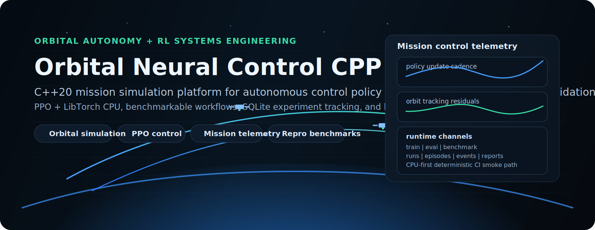

<p align="center">
  
</p>

# Orbital Neural Control CPP

C++20 autonomy/control engineering baseline for PPO-based continuous control with reproducible `train`, `eval`, and `benchmark` workflows.

Primary runtime binary: `nmc` (CPU-first, LibTorch).

## Scope and Status

### Implemented baseline (CI-gated)

- Layered runtime under `src/`:
  - `domain` (PPO, env contracts, inference contracts, typed config)
  - `application` (`TrainingRunner`, `EvaluationRunner`, `BenchmarkRunner`)
  - `infrastructure` (artifacts, checkpoints, SQLite persistence, reporting)
  - `interfaces` (CLI)
  - `common` (time/JSON helpers)
- `nmc train`, `nmc eval`, `nmc benchmark`
- Artifact contract under `artifacts/`
- SQLite telemetry (`runs`, `episodes`, `events`, `benchmarks`)
- Baseline CI configure/build/smoke artifact checks

### Optional expansion modules (not required for baseline build)

- `core`, `control`, `sim`, `rl`
- `backend` (C++ REST/WebSocket telemetry service)
- `frontend` (React + TypeScript + Vite mission replay UI)
- `training` and `mlops` (Python orchestration, MLflow, ONNX export)

### Roadmap / future tracks (not shipped baseline)

- Higher-fidelity orbital dynamics in baseline runtime
- TensorRT runtime integration (currently stub only)
- CUDA-first training path

## Quickstart (Repository Root)

All commands below are expected to run from repository root.

### 1) Bootstrap dependencies and build baseline

```bash
bash tools/setup_libtorch_cpu.sh
cmake --preset dev
cmake --build --preset build
./build/nmc help
```

### 2) Smoke benchmark (fast CI-like path)

```bash
./build/nmc benchmark --quick --name smoke_local --seed 7
```

### 3) Train

```bash
./build/nmc train --env point_mass --seed 7 --updates 30 --run-id train_local_001
```

Fast smoke-friendly train profile:

```bash
./build/nmc train --quick --run-id train_quick_001 --seed 7
```

### 4) Eval

```bash
./build/nmc eval --checkpoint artifacts/latest/checkpoint.pt --episodes 10 --backend libtorch --run-id eval_local_001
```

## CLI Contract

```text
nmc train [options]
nmc eval [options]
nmc benchmark [--quick|--full] [--seed N] [--name NAME]
```

Key options:

- `train`: `--env`, `--quick`, `--seed`, `--num-envs`, `--updates`, `--rollout-steps`, `--ppo-epochs`, `--minibatch-size`, `--hidden-dim`, `--learning-rate`, `--run-id`, `--resume-checkpoint`, `--live-steps`, `--pm-*`
- `eval`: `--checkpoint`, `--env`, `--episodes`, `--max-steps`, `--seed`, `--backend`, `--deterministic`, `--run-id`, `--pm-*`
- `benchmark`: `--quick|--full`, `--seed`, `--name`

`--pm-*` reward flags:

- `--pm-pos-log-w`
- `--pm-pos-exp-w`
- `--pm-vel-align-w`
- `--pm-vel-error-w`
- `--pm-control-w`
- `--pm-risk-w`
- `--pm-potential-shaping`

## PPO Runtime Refactor (Current Baseline)

The PPO stack is now split into explicit components with cleaner ownership:

- `GaussianPolicy` (action distribution, sampling, log-prob, entropy)
- `ValueNetwork` (state value estimation)
- `RolloutBuffer` (preallocated rollout tensors + GAE build)
- `PPOTrainer` (orchestration + mini-batch optimization)

Primary runtime implementations live under:

- `src/domain/ppo/`

Mirrored RL module-facing adapters now exist under:

- `rl/include/orbital/rl/policy/`
- `rl/include/orbital/rl/value/`
- `rl/include/orbital/rl/ppo/`

Engineering improvements included:

- C++20 concepts/ranges usage in trainer statistics code
- `std::span` flow in rollout ingestion
- Reduced tensor-copy churn via preallocated rollout buffer
- Cleaner mini-batch shuffle path (`randperm` + `narrow` windowing)

## PointMass Reward Shaping Upgrade

`PointMassEnv` now uses a richer reward model tuned for orbital-control style convergence:

- positional shaping: `exp(-k|e_pos|)` bonus + `log(1 + c e_pos^2)` penalty
- velocity shaping: directional alignment bonus + velocity-magnitude error penalty
- control/fuel: quadratic effort penalty + soft thrust constraint
- safety/risk corridor: out-of-corridor and near-boundary penalties
- efficiency bonus: low-thrust / low-kinetic bias near target
- optional potential-based shaping: `gamma * Phi(s') - Phi(s)`

All weights are in `PointMassRewardConfig` and serialized in run manifests/config JSON (`train` and `eval`).

Example with custom shaping weights:

```bash
./build/nmc train --quick --run-id train_reward_tuned --seed 7 \
  --pm-pos-log-w 0.65 \
  --pm-pos-exp-w 1.20 \
  --pm-vel-align-w 0.35 \
  --pm-vel-error-w 0.20 \
  --pm-control-w 0.04 \
  --pm-risk-w 0.25 \
  --pm-potential-shaping true
```

## Artifact and Persistence Contract

```text
artifacts/
  runs/<run_id>/
    manifest.json
    training_metrics.csv
    training_summary.json
    evaluation_summary.json
    live_rollout.csv
    checkpoints/policy_last.pt
    checkpoints/policy_last.meta
  latest/
    manifest.json
    training_metrics.csv
    evaluation_summary.json
    checkpoint.pt
    checkpoint.meta
  benchmarks/
    latest.json
    latest.csv
  checkpoints/
  reports/
  experiments.sqlite
```

SQLite tables (`src/infrastructure/persistence/sqlite_experiment_store.*`):

- `runs`
- `episodes`
- `events`
- `benchmarks`

## Build Presets

- `dev`: baseline local build (`build/`)
- `ci`: baseline CI-style build (`build-ci/`)
- `debug-sanitized`: Debug + ASAN/UBSAN
- `orbital-core-only`: optional `core` targets
- `orbital-stack`: optional `core` + `backend`

Examples:

```bash
cmake --preset ci
cmake --build --preset build-ci
ctest --test-dir build-ci --output-on-failure --verbose -R nmc_smoke_benchmark
```

## Docker / Compose

Repository includes compose services for optional stack usage.

### Bring up optional services

```bash
docker compose up --build -d mlflow backend frontend
```

### Run training service against MLflow

```bash
docker compose run --rm training
```

### Check service logs

```bash
docker compose logs -f mlflow backend frontend
```

Endpoints:

- Frontend: `http://localhost:3000`
- Backend health: `http://localhost:8080/health`
- MLflow: `http://localhost:5000`

`.dockerignore` intentionally excludes host build outputs and caches (`build*/`, `CMakeCache.txt`, `CMakeFiles/`, `artifacts/`, etc.) to prevent container build contamination.

## Frontend and Backend Notes

- Frontend stack is **React + TypeScript + Vite** (not Next.js).
- Frontend currently supports mock-data mission replay and optional backend wiring via:
  - `VITE_BACKEND_HTTP`
  - `VITE_BACKEND_WS`
- Backend is an optional telemetry service and not required for baseline `nmc` validation.

## CI Baseline

GitHub Actions validates a meaningful baseline path:

1. source/docs contracts exist
2. configure with `cmake --preset ci`
3. build `nmc`
4. run smoke benchmark test
5. verify artifacts and JSON schema expectations
6. verify SQLite persistence rows
7. upload smoke artifacts

There is a separate optional portability check for `core` cross-compile (ARM64 toolchain).

## Documentation

- [Build Guide](docs/build.md)
- [Architecture](docs/architecture.md)
- [Roadmap](docs/roadmap.md)
- [Security](docs/SECURITY.md)
- UML:
  - [Component Diagram](docs/uml/component-diagram.md)
  - [Class Diagram](docs/uml/class-diagram.md)
  - [Training Sequence](docs/uml/sequence-training.md)
- [Contributing](CONTRIBUTING.md)

## Current Constraints (Intentional)

- CPU-first baseline; no CUDA path in default runtime
- TensorRT backend is a stub placeholder
- Baseline environment set is narrow (`point_mass`, optional MuJoCo cartpole when enabled)

This repository prioritizes an honest, reproducible baseline over broad but unverified claims.
