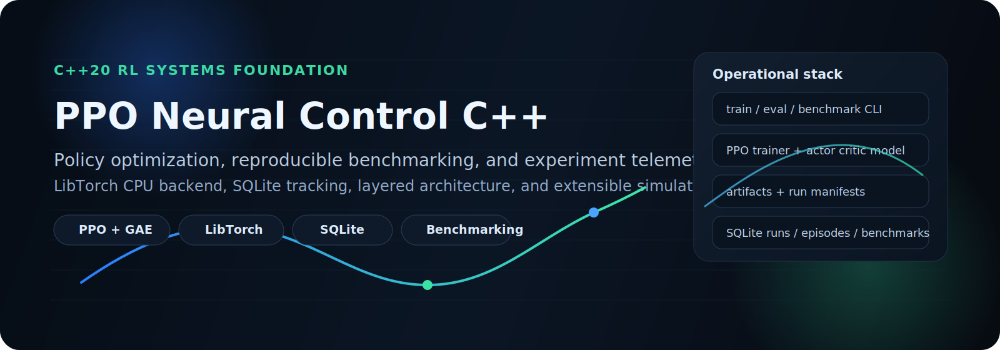
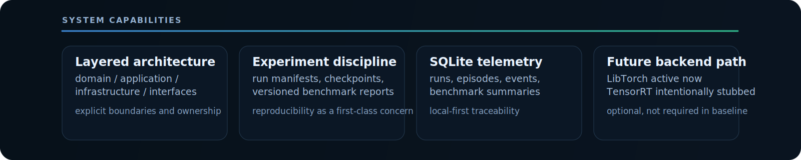
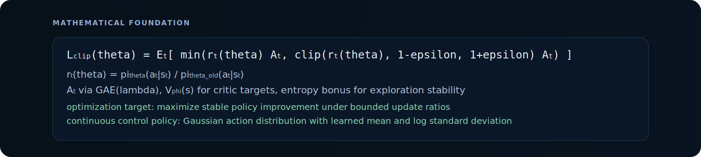
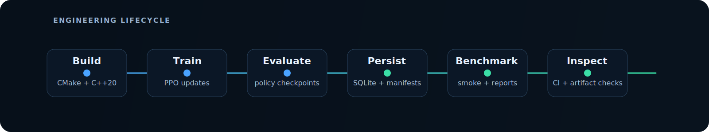

# PPO Neural Control C++

<p align="center">
  
</p>

**C++20 reinforcement learning systems foundation for policy optimization, reproducible experimentation, and extensible continuous-control simulation.**

CPU-first baseline with PPO + LibTorch, SQLite experiment tracking, benchmarkable train/eval flows, and a clean architecture prepared for future advanced autonomy domains.

## Core Stack

<p align="center">
  <a href="https://en.cppreference.com/w/cpp/20"></a>
  
  
  
  
</p>

<p align="center">
  
  
  
  
  
</p>

<p align="center">
  <a href="https://github.com/gabriel-lab-ia/PPO_Neural-Control-cpp/actions/workflows/ci.yml"></a>
  
  
  
</p>

<p align="center">
  
</p>

## Why This Repository Exists

Most RL repositories optimize for quick experimentation. This repository optimizes for **engineering discipline in RL systems**:

- clear boundaries between domain logic, orchestration, infrastructure, and interfaces
- reproducible train/eval/benchmark lifecycle
- structured artifact outputs and local experiment traceability
- CPU-first operational baseline suitable for continuous CI validation

The result is a maintainable C++20 PPO foundation that can evolve into more demanding control and autonomy domains without architectural resets.

## Systems Overview

The codebase is intentionally layered:

- `src/domain/`: PPO math/logic, environment contracts, inference backend interfaces
- `src/application/`: train/eval/benchmark runners
- `src/infrastructure/`: artifacts, checkpoints, SQLite persistence, reporting
- `src/interfaces/`: CLI entrypoint and command surface
- `src/common/`: cross-cutting utilities

Detailed engineering docs:

- `docs/architecture.md`
- `docs/uml/component-diagram.md`
- `docs/uml/class-diagram.md`
- `docs/uml/sequence-training.md`
- `docs/roadmap.md`

## Mathematical Foundation

<p align="center">
  
</p>

This project implements an actor-critic PPO training loop for continuous control with clipped policy updates and generalized advantage estimation.

**Clipped PPO objective**

\[
L^{\text{clip}}(\theta)=\mathbb{E}_t\left[\min\left(r_t(\theta)\hat{A}_t,\ \text{clip}(r_t(\theta), 1-\epsilon, 1+\epsilon)\hat{A}_t\right)\right]
\]

with

\[
r_t(\theta)=\frac{\pi_\theta(a_t\mid s_t)}{\pi_{\theta_{\text{old}}}(a_t\mid s_t)}
\]

**Value and advantage path**

- critic learns \(V_\phi(s_t)\) targets
- advantages are estimated with GAE(\(\lambda\)) for lower-variance policy gradients
- entropy regularization supports exploration stability

**Continuous action policy**

- stochastic Gaussian policy with learned mean and log standard deviation
- clipped updates + value stabilization + entropy control improve optimization robustness

This is not only “RL code”; it is an implementation of stable stochastic policy optimization under repeatable engineering constraints.

## Architecture and Execution Flow

<p align="center">
  
</p>

Primary commands:

```bash
./build/nmc train --env point_mass --seed 7 --updates 30
./build/nmc eval --checkpoint artifacts/latest/checkpoint.pt --episodes 10 --backend libtorch
./build/nmc benchmark --quick --name smoke
```

Script aliases:

```bash
./scripts/train.sh ...
./scripts/eval.sh ...
./scripts/benchmark_smoke.sh
```

## Reproducible Experiment Pipeline

Artifacts are organized under:

```text
artifacts/
  runs/<run_id>/
    manifest.json
    training_metrics.csv
    training_summary.json
    evaluation_summary.json
    live_rollout.csv
    checkpoints/
      policy_last.pt
      policy_last.meta
  checkpoints/
  reports/
  benchmarks/
  latest/
  experiments.sqlite
```

Each run includes structured metadata for traceability and automation.

## SQLite Experiment Tracking

`artifacts/experiments.sqlite` captures:

- `runs`: run configuration, lifecycle, summary
- `episodes`: train/eval episode telemetry
- `events`: run-level operational events
- `benchmarks`: benchmark summaries

This gives local-first observability without introducing heavyweight external infrastructure.

## CI and Engineering Validation

The CI workflow (`.github/workflows/ci.yml`) performs:

1. deterministic baseline configure/build (CPU-first)
2. smoke benchmark execution through CTest
3. generated artifact validation (`benchmark`, `manifest`, `checkpoint`)

This repository treats CI as part of the product surface, not an afterthought.

## Build and Dependencies

Requirements:

- CMake 3.24+
- C++20 compiler (GCC 13+ recommended)
- LibTorch CPU
- SQLite runtime (`libsqlite3`)
- optional MuJoCo for `mujoco_cartpole`

Bootstrap:

```bash
bash tools/setup_libtorch_cpu.sh
cmake --preset dev
cmake --build --preset build
```

## Optional Features and Future Direction

- **MuJoCo** is optional and guarded behind `NMC_ENABLE_MUJOCO`.
- **TensorRT** is intentionally not active in baseline; backend abstraction exists for future integration.
- **CUDA** is not required in the current project path.

Long-term direction: evolve from this RL systems foundation toward advanced autonomous control domains (including orbital/satellite control environments) through environment and simulation expansion, while preserving PPO core discipline.
