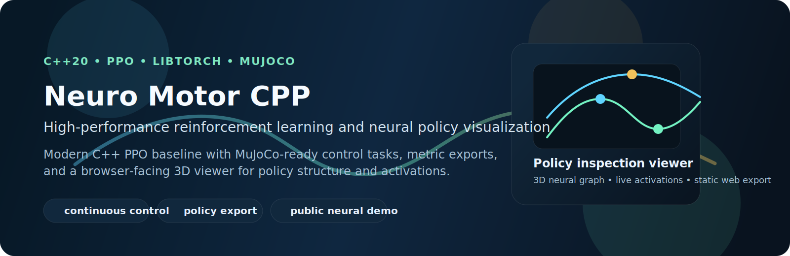
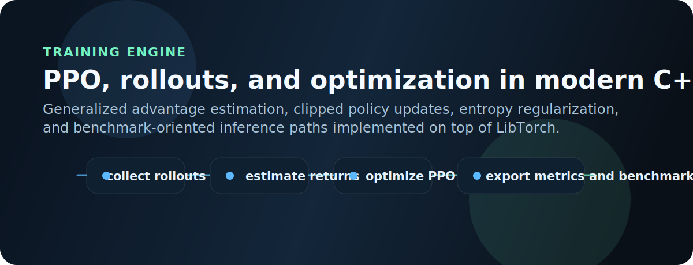
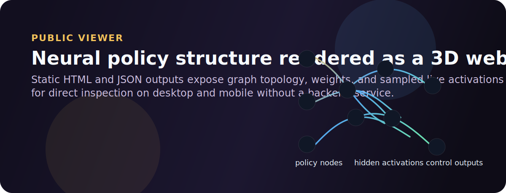

# Neuro Motor CPP

<p align="center">
  
</p>

<p align="center">
  
  
  
  
  
</p>

`Neuro Motor CPP` is a modern C++20 reinforcement learning project that combines `LibTorch`, `PPO`, `MuJoCo`, and browser-delivered neural visualization. It is designed as a serious research-engineering baseline for continuous control, with a public static site that exposes trained-policy structure, learning curves, and interactive 3D network inspection.

## Visual Overview

<p align="center">
  
  
</p>

## Public Links

- Live project page: `https://gabriel-lab-ia.github.io/PPO_Neural-Control-cpp/`
- Direct 3D viewer: `https://gabriel-lab-ia.github.io/PPO_Neural-Control-cpp/demo/neural_network_3d.html`
- Learning curve: `https://gabriel-lab-ia.github.io/PPO_Neural-Control-cpp/demo/learning_curve.svg`
- Benchmark summary: `https://gabriel-lab-ia.github.io/PPO_Neural-Control-cpp/demo/benchmark_summary.json`

## Highlights

- PPO implementation in modern C++ with `LibTorch`
- optional MuJoCo integration through a clean `Environment` interface
- critic stabilization with value clipping and robust value loss
- low-latency policy inference with benchmark export
- CSV metrics and SVG learning curves
- live rollout capture from the trained policy
- standalone 3D HTML viewer for policy structure and sampled activations
- touch-friendly mobile interaction in the public visualization
- static publishing path through `docs/` for GitHub Pages

## Repository Layout

- `src/app/`: application entrypoints and training orchestration
- `src/env/`: environment interface and concrete environments
- `src/model/`: PPO agent, policy network, and value network
- `src/train/`: rollout collection, GAE, and PPO optimization
- `src/utils/`: logging, artifact export, and 3D neural viewer generation
- `assets/mujoco/`: MuJoCo XML assets
- `tools/`: setup, plotting, viewing, and publishing scripts
- `docs/`: static site and GitHub Pages output
- `notebooks/`: analysis notebooks

## Technical Focus

This repository is strongest as:

- a formal PPO reference implementation in C++
- a MuJoCo-ready continuous-control baseline
- a neural visualization project that turns policy internals into a public 3D browser artifact

The codebase emphasizes a clean systems-level reinforcement learning stack rather than a broad plugin ecosystem. The current scope favors clarity, reproducibility, and controllable performance characteristics.

## Requirements

- GCC 13+
- CMake 3.24+
- LibTorch 2.2.2
- Eigen
- MuJoCo 3.2.6 or newer for MuJoCo environments

## Quick Start

This repository does not commit LibTorch binaries. If `lib/libtorch/` is missing, install the CPU package locally:

```bash
bash tools/setup_libtorch_cpu.sh
```

Configure:

```bash
cmake --preset dev
```

Build:

```bash
cmake --build --preset build
```

Run the default PPO baseline:

```bash
./build/motor
```

Generate the learning-curve SVG:

```bash
python3 tools/plot_learning_curve.py artifacts/learning_curve.csv artifacts/learning_curve.svg
```

## MuJoCo Training

Build with MuJoCo support:

```bash
cmake --preset dev -DNMC_ENABLE_MUJOCO=ON -DNMC_MUJOCO_ROOT=$HOME/.local/mujoco-3.2.6
cmake --build --preset build
```

Train the PPO agent in MuJoCo:

```bash
NMC_ENV=mujoco_cartpole ./build/motor
```

Run a live policy rollout after training:

```bash
NMC_ENV=mujoco_cartpole NMC_LIVE_POLICY=1 NMC_LIVE_STEPS=64 ./build/motor
```

## Visualization

Open the generated 3D network viewer locally:

```bash
xdg-open artifacts/neural_network_3d.html
```

Open the MuJoCo viewer for the project cart-pole:

```bash
./tools/view_mujoco.sh
```

## Web Publishing

This repository is prepared for static deployment through GitHub Pages.

Sync the current demo into `docs/`:

```bash
python3 tools/publish_demo.py
```

The committed web assets are expected under `docs/demo/`.

After pushing the repository to GitHub and enabling Pages, the generated site exposes:

- `/` landing page
- `/demo/neural_network_3d.html` direct 3D neural viewer
- `/demo/learning_curve.svg` exported learning curve
- `/demo/benchmark_summary.json` benchmark and efficiency snapshot

## Generated Outputs

- `artifacts/learning_curve.csv`
- `artifacts/learning_curve.svg`
- `artifacts/live_rollout.csv`
- `artifacts/benchmark_summary.json`
- `artifacts/neural_network_3d.html`
- `artifacts/neural_network_3d.json`

## Development Notes

- The default CI build targets the non-MuJoCo baseline so public builds stay lightweight.
- MuJoCo support is optional and activated through `NMC_ENABLE_MUJOCO`.
- The static site is generated from local artifacts; `docs/` is the publishable output.

## License

This project is distributed under the MIT License. See [LICENSE](LICENSE).
