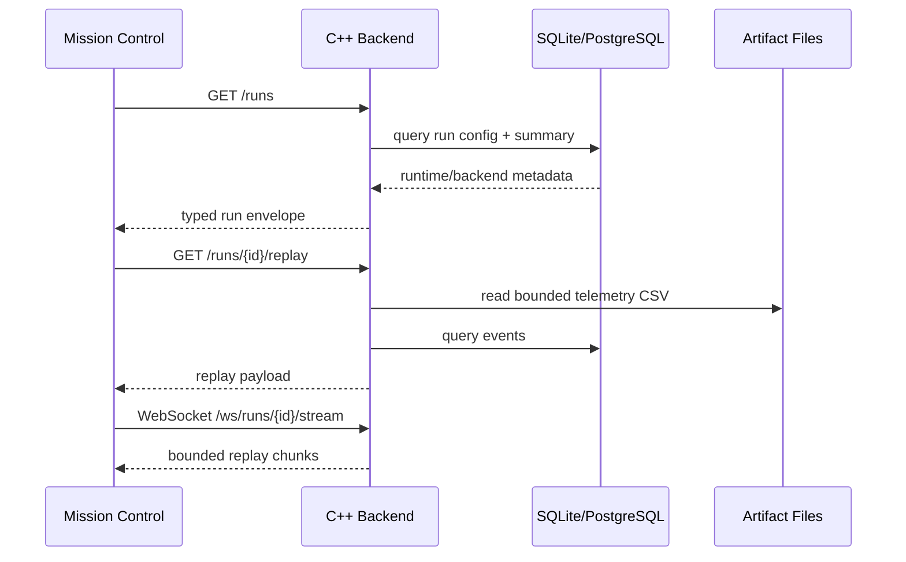

# Backend API Flow

The backend is optional and currently has no authentication layer. Job execution is disabled by default. Do not expose it publicly without authentication, authorization, request limits, TLS termination, and network policy.

