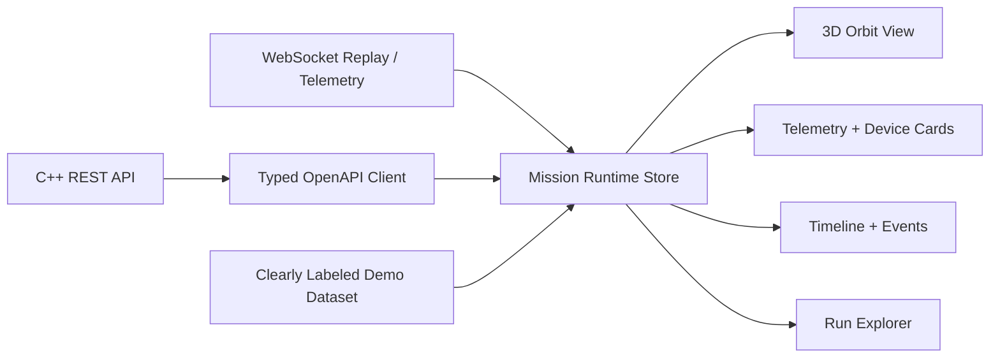

# Frontend Mission Control

The React/TypeScript UI exposes backend runtime, resolved Torch device, CUDA fallback status, latency, replay, and artifacts where the API provides them. When the backend is unavailable, the UI labels the source as mock/demo fallback. It must not present demo values as live mission telemetry.

PPO time-series charts remain a roadmap item until the backend exposes structured training metrics rather than requiring the browser to parse CSV artifacts.

