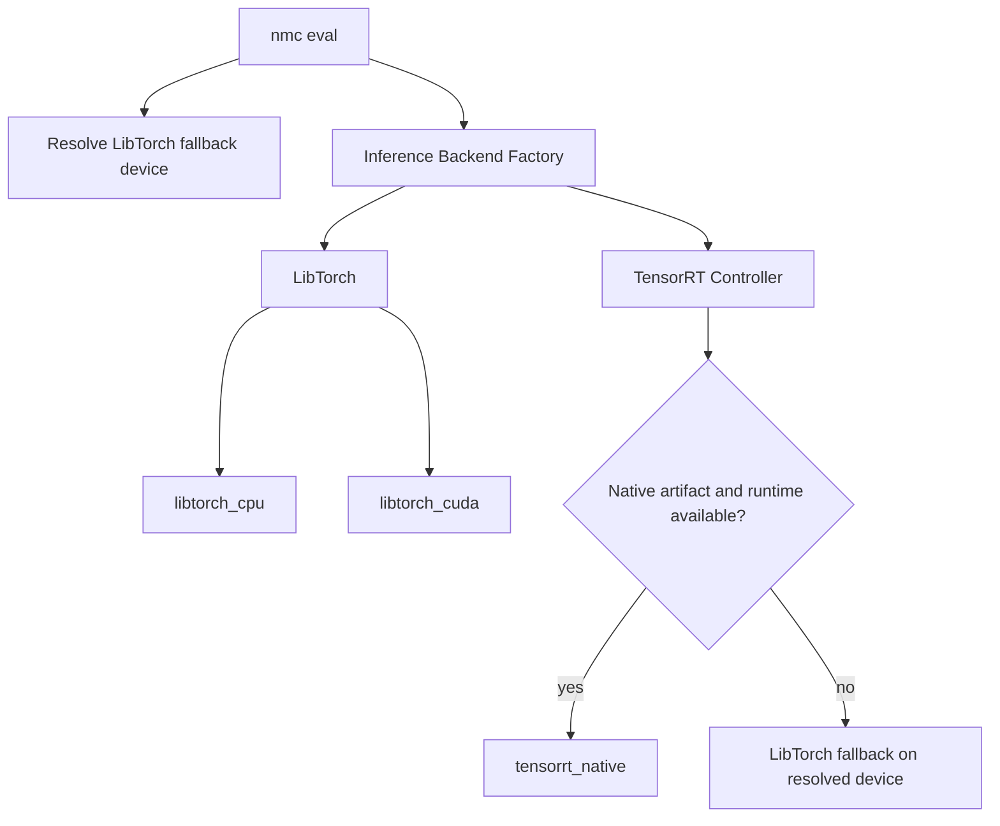

# Inference Backends

TensorRT native execution requires an ONNX or engine artifact and a compatible TensorRT/CUDA build. A `.pt` evaluation through a TensorRT CLI name may use LibTorch fallback. Summaries expose `runtime`, `uses_cuda`, and `is_emulated`; fallback latency must not be described as TensorRT acceleration.

