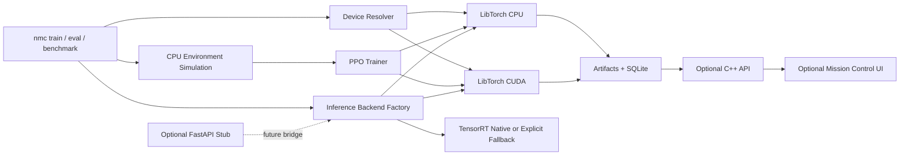

# Architecture Overview

Orbital Neural Control CPP ships a reproducible C++20 baseline and keeps optional platform modules outside the critical CLI path.

## Shipped Boundaries

- The default CI and reproducibility path is LibTorch CPU.
- CUDA-aware LibTorch training and inference are selected at runtime when the installed LibTorch build and host support CUDA.
- Environments remain CPU simulated. Observations cross to the selected LibTorch device and actions cross back to CPU deliberately.
- TensorRT reports whether native runtime or LibTorch fallback was used.
- Backend, frontend, FastAPI, Docker, and Kubernetes remain optional modules.

