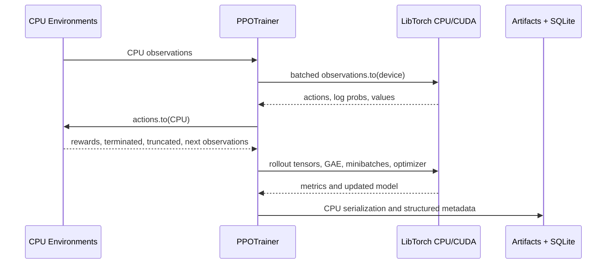

# PPO Training Flow

The environment boundary is intentionally explicit. CUDA currently accelerates policy/value work, not environment propagation. This avoids claiming a CUDA-first simulator while preserving a path toward vectorized GPU environments.

Truncation and termination semantics remain distinct in the rollout buffer so time-limit truncation can bootstrap value estimates.

