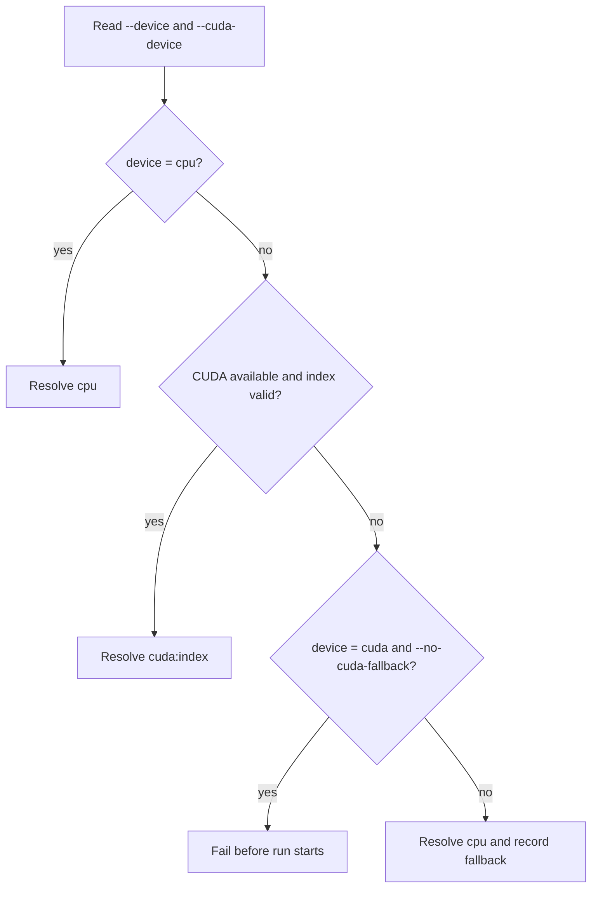

# Runtime Device Selection

The shared resolver lives in `src/domain/runtime/device_resolver.*`.



Commands:

```bash
./build/nmc train --device cpu
./build/nmc train --device auto
./build/nmc train --device cuda --cuda-device 0 --no-cuda-fallback
./build/nmc eval --device auto --checkpoint artifacts/latest/checkpoint.pt
./build/nmc benchmark --quick --device auto
```

`cpu` is the default. `auto` and non-strict `cuda` requests record any fallback in manifests and summaries. The portable C++ API reports CUDA availability and device count; the metadata name remains `cuda:<index>` unless a future CUDA SDK-specific inspector is added.

