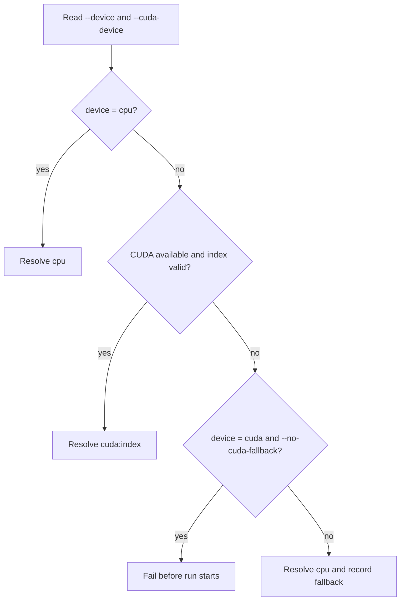

# Runtime Device Selection

The shared resolver lives in `src/domain/runtime/device_resolver.*`.



Commands:

```bash
./build/nmc train --device cpu
./build/nmc train --device auto
./build/nmc train --device cuda --cuda-device 0 --no-cuda-fallback
./build/nmc eval --device auto --checkpoint artifacts/latest/checkpoint.pt
./build/nmc benchmark --quick --device auto
```

`cpu` is the default. `auto` and non-strict `cuda` requests record any fallback in manifests and summaries. The portable C++ API reports CUDA availability and device count; the metadata name remains `cuda:<index>` unless a future CUDA SDK-specific inspector is added.

## Deterministic CUDA Requirement

The runtime enables LibTorch deterministic algorithms. Before a run resolves to CUDA, CuBLAS requires a deterministic workspace configuration:

```bash
export CUBLAS_WORKSPACE_CONFIG=:4096:8
```

`:16:8` is also accepted. The runtime fails with a focused diagnostic when CUDA is selected without either value; deterministic behavior is never disabled silently.

On June 10, 2026, the strict CUDA path was functionally validated on one NVIDIA GeForce RTX 4050 Laptop GPU with CUDA Toolkit 12.5 and CUDA-enabled LibTorch cu124. This is local compatibility evidence, not a guarantee for every driver, GPU, or LibTorch build.
