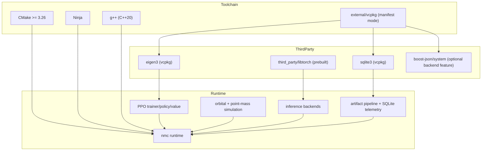

# Dependency Diagram

## Deterministic constraints

- fixed triplet: `x64-linux`
- vcpkg pinned by `builtin-baseline`
- LibTorch loaded from pinned prebuilt package path (`third_party/libtorch`)
- TensorRT path optional with non-fatal fallback to LibTorch
