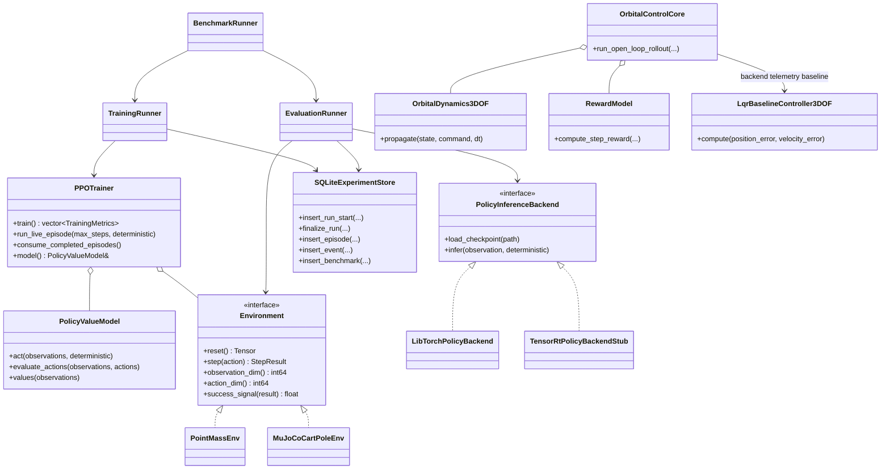

# Class Diagram

```mermaid
classDiagram
    class PolicyValueModel {
        +act(observations, deterministic)
        +evaluate_actions(observations, actions)
        +values(observations)
    }

    class PPOTrainer {
        +train() vector~TrainingMetrics~
        +run_live_episode(max_steps, deterministic)
        +consume_completed_episodes()
        +model() PolicyValueModel&
    }

    class Environment {
        <<interface>>
        +reset() Tensor
        +step(action) StepResult
        +observation_dim() int64
        +action_dim() int64
        +success_signal(result) float
    }

    class PointMassEnv
    class MuJoCoCartPoleEnv

    class PolicyInferenceBackend {
        <<interface>>
        +load_checkpoint(path)
        +infer(observation, deterministic)
    }

    class LibTorchPolicyBackend
    class TensorRtPolicyBackendStub

    class TrainingRunner
    class EvaluationRunner
    class BenchmarkRunner

    class SQLiteExperimentStore {
        +insert_run_start(...)
        +finalize_run(...)
        +insert_episode(...)
        +insert_event(...)
        +insert_benchmark(...)
    }

    class OrbitalControlCore {
        +run_open_loop_rollout(...)
    }

    class OrbitalDynamics3DOF {
        +propagate(state, command, dt)
    }

    class RewardModel {
        +compute_step_reward(...)
    }

    class LqrBaselineController3DOF {
        +compute(position_error, velocity_error)
    }

    Environment <|.. PointMassEnv
    Environment <|.. MuJoCoCartPoleEnv

    PolicyInferenceBackend <|.. LibTorchPolicyBackend
    PolicyInferenceBackend <|.. TensorRtPolicyBackendStub

    PPOTrainer o-- PolicyValueModel
    PPOTrainer o-- Environment

    TrainingRunner --> PPOTrainer
    TrainingRunner --> SQLiteExperimentStore

    EvaluationRunner --> PolicyInferenceBackend
    EvaluationRunner --> Environment
    EvaluationRunner --> SQLiteExperimentStore

    BenchmarkRunner --> TrainingRunner
    BenchmarkRunner --> EvaluationRunner

    OrbitalControlCore o-- OrbitalDynamics3DOF
    OrbitalControlCore o-- RewardModel
    OrbitalControlCore --> LqrBaselineController3DOF : backend telemetry baseline
```
