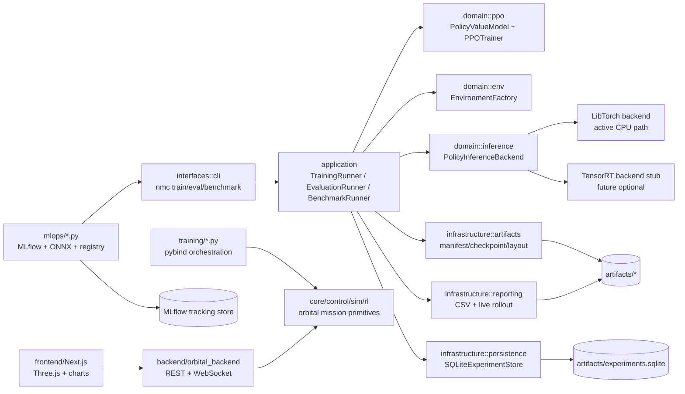

# Component Diagram

```mermaid
flowchart LR
    CLI[interfaces::cli\nnmc train/eval/benchmark] --> APP[application\nTrainingRunner / EvaluationRunner / BenchmarkRunner]

    APP --> PPO[domain::ppo\nPolicyValueModel + PPOTrainer]
    APP --> ENV[domain::env\nEnvironmentFactory]
    APP --> INF[domain::inference\nPolicyInferenceBackend]

    APP --> ART[infrastructure::artifacts\nmanifest/checkpoint/layout]
    APP --> DB[infrastructure::persistence\nSQLiteExperimentStore]
    APP --> REP[infrastructure::reporting\nCSV + live rollout]

    INF --> LIBTORCH[LibTorch backend\nactive CPU path]
    INF --> TRTSTUB[TensorRT backend stub\nfuture optional]

    TRAINPY[training/*.py\npybind orchestration] --> CORE[core/control/sim/rl\norbital mission primitives]
    MLFLOW[mlops/*.py\nMLflow + ONNX + registry] --> CLI
    MLFLOW --> MLF[(MLflow tracking store)]

    BACKEND[backend/orbital_backend\nREST + WebSocket] --> CORE
    FRONTEND[frontend/Next.js\nThree.js + charts] --> BACKEND

    DB --> SQLITE[(artifacts/experiments.sqlite)]
    ART --> FS[(artifacts/*)]
    REP --> FS
```
