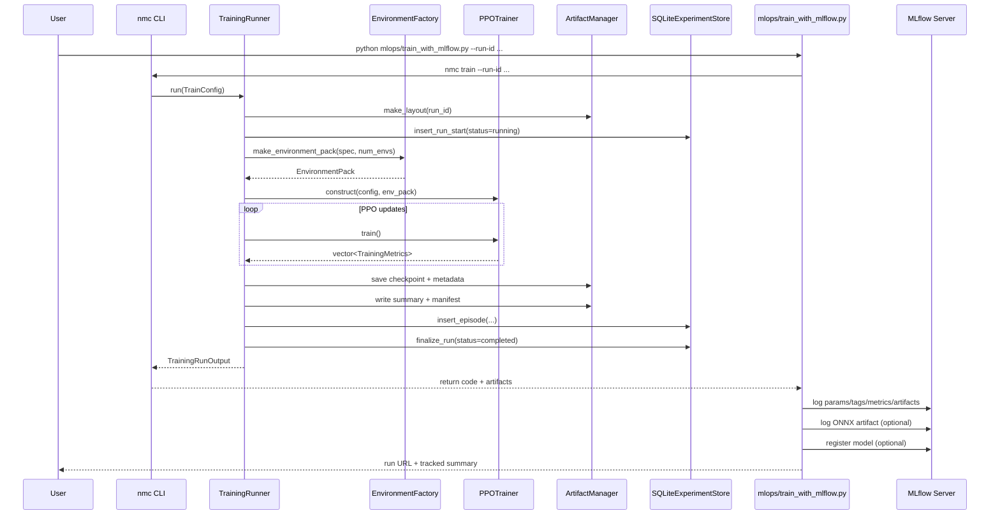

# Training Sequence

```mermaid
sequenceDiagram
    participant User
    participant CLI as nmc CLI
    participant TR as TrainingRunner
    participant EF as EnvironmentFactory
    participant PT as PPOTrainer
    participant ART as ArtifactManager
    participant DB as SQLiteExperimentStore
    participant MLF as mlops/train_with_mlflow.py
    participant MF as MLflow Server

    User->>MLF: python mlops/train_with_mlflow.py --run-id ...
    MLF->>CLI: nmc train --run-id ...
    CLI->>TR: run(TrainConfig)
    TR->>ART: make_layout(run_id)
    TR->>DB: insert_run_start(status=running)
    TR->>EF: make_environment_pack(spec, num_envs)
    EF-->>TR: EnvironmentPack
    TR->>PT: construct(config, env_pack)

    loop PPO updates
        TR->>PT: train()
        PT-->>TR: vector<TrainingMetrics>
    end

    TR->>ART: save checkpoint + metadata
    TR->>ART: write summary + manifest
    TR->>DB: insert_episode(...)
    TR->>DB: finalize_run(status=completed)
    TR-->>CLI: TrainingRunOutput
    CLI-->>MLF: return code + artifacts

    MLF->>MF: log params/tags/metrics/artifacts
    MLF->>MF: log ONNX artifact (optional)
    MLF->>MF: register model (optional)
    MLF-->>User: run URL + tracked summary
```
